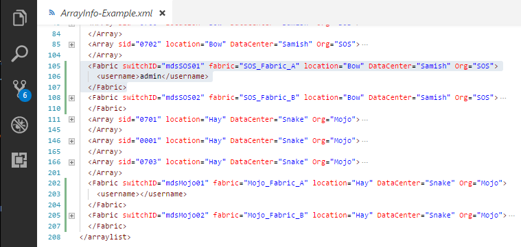

# Cisco Module

The Cisco module contains a set of cmdlets for automating the setting of device-aliases and tracking flogi login entries for one or more SAN Fabrics.

The Cisco module requires each SAN Fabric to have a fabric record defined in the XMLDB.  Shown below is an example of 4 different fabric records defined
in the example XMLDB. The cmdlets will automatically discover the remaining switches in each SAN Fabric, so there isn't a need to define an entry for all of the
switches.

At line 105 is an example of defining SAN Fabric named, **SOS_Fabric_A**. There is one fabric record for each fabric to be defined. The tags and attributes are used as follows.

Attribute | Description
--------- | -----------
switchID | A DNS resolvable name or IP Address of a switch in the SAN Fabric
fabric | The name assigned to the SAN Fabric
location | Name of the city where the array is located
DataCenter | Name of the building where the SAN Fabric is housed
Org | Name of the tenate who is resposible for the SAN Fabric
username | The account name used to log into the switch(s)

If there is a shared account name used to access the switches, then specified that account name
in the **username** tag , then the cmdlets will prompt only once for a password for that account and
then save the credentials in an encrypted file in the folder, **CredInfo**. The encrypted file can only
be decrypted on the same computer.

If there is not a shared account name used to access the switches, then do NOT specify a value for the
**username** tag. Each different user will need to specify their account and password for switch access.
These account credentials are encrypted and saved in the same folder.

When a password is changed for an account, the encrypted file for that account will need to be deleted
in order to be prompted for the new credentials.

When any of the Cisco cmdlets are first executed, they will create the proper folder structure in the execution
directory. Using the example XMLDB from above, the following folder structure will be created in the execution
directory.

    SwInfo-SOS
      SOS_Fabric_A
        Archive
      SOS_Fabric_B
        Archive
    SwInfo-Mojo
      Mojo_Fabric_A
        Archive
      Mojo_Fabric_b
        Archive

After the fabric records have been defined in the XMLDB, a SAN Fabric domain csv file needs to be created for each SAN Fabric.
This can be accomplished by executing the following cmdlet.

    Connect-VeFabric -FabricName SOS_Fabric_A -createCSV

This will created a SAN Fabric domain csvfile named, **SOS_Fabric_A.csv** which contains a list of all the
switches in the fabric. It will also perform a test SSH login to each of the switches. Should more switches be added
to this fabric at a later date, simply re-executed this command to discover the new switches.