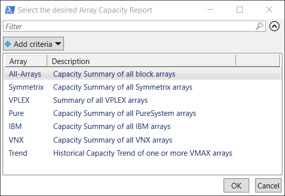
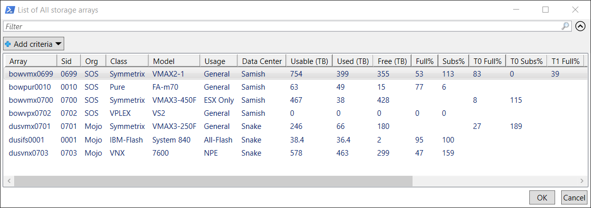

Displays an inventory listing of existing arrays along with capacity usage information.
***
Launch a PowerShell console from the configured folder and enter the following command execute the script.

**PS> Get-VeArrayInfo**

**Click** on the desired row and click on **'OK'** button.

A dialog similar to the following will be displayed.

The displayed table can be resized as desired. Left **click** on any column to sort by that column.

**Right-Click** on a column to select the desired columns to be displayed.

**Click** on the **Add criteria** button to filter the desired rows to be displayed.

Selecting a row and clicking on the **'OK'** button will cause a console prompt asking
whether or not to display a performance report for the selected array, if performance data is configure for the selected array type.

After clicking the **'OK'** button, a dialog will be display for selecting several different performance reports.

Clicking on the **'Cancel'** button will close the dialog and return to the PowerShell console prompt.

Enter **'N' or 'No'** to return to the PowerShell console prompt.

See **Get-VeArrayMetrics**, **Get-VePureMetrics**, or **Get-VeVPlexMetrics** for information on array performance reports.

***

**THE METRICS CMDLETS WILL BE IMPLEMENTED IN THE NEAR FUTURE**

***

To get help and syntax information enter the following.

**PS1> Get-Help Get-VeArrayInfo -full**

***

## Logic flow

**Get-VeArrayInfo.ps1** opens the most recent xml DB file found in the sub-folder, **ArrayInfo**.

The xml DB file is generated and updated by the script, **Update-VeArrayInfo.ps1**.