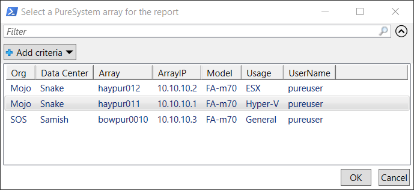
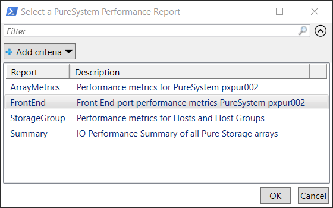
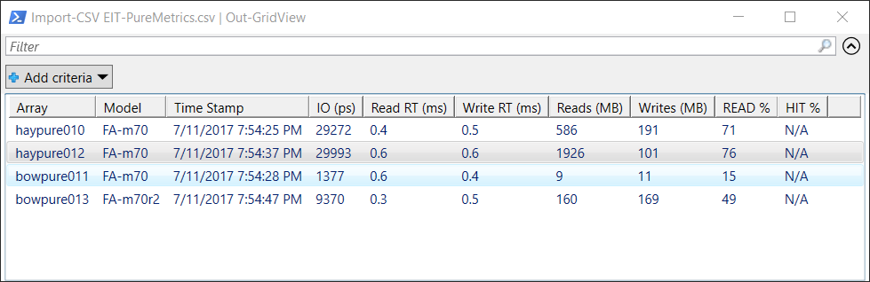

Reports on PureSystem array performance data by executing RESTAPI calls using the Pure Storage
PowerShell SDK 1.7.4 module.
***
To get detailed help information and/or examples of executing **Get-VePureMetrics** can be
displayed by entering, the following command.

    PS> get-help Get-VePureMetrics -full

**Get-VePureMetrics** supports CLI based method of execution by specifying specific parameters
or a GUI based method where parameter values are selected from dialog boxes.

Executing this script without parameters will cause a dialog similar to the one below to be displayed
for selection of the required parameter values.

    PS> Get-VePureMetrics

Select the desired array and click on the **'OK'** or the **'CANCEL'** button.  If **'OK'** was
selected, a dialog will be presented showing the available reports for selection.

The above example selected the **Summary** report and the following output is displayed. The Summary
report can be executed from the CLI and the console will be updated every 6 minutes.

    PS> Get-VePureMetrics -report summary

The Front End report above is the same details reported by the Pure CLI command, but processed
through the RESTAPI.

    'purehost monitor --balance'  
