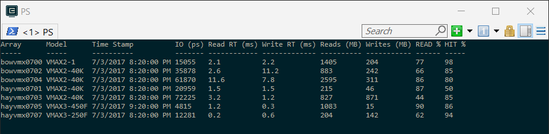

Reports on Dell/EMC Symmetrix array performance by executing RESTAPI calls to a Unisphere server.

By default, only the last hour of metric data points are displayed for any performance category.

The following Symmetrix performance reports are available for one or more storage arrays.

Report | Description
------ | -----------
ArrayMetrics | General storage array performance metrics
FrontEnd | Front End director performance metrics
QDC-FrontEnd | Queue Depth Count for Front End directors
SysCall | Array SysCall performance metrics
StorageGroup | Table of Storage Groups for a symmetrix array
Summary | IO Performance Summary metrics for all storage arrays. Updates every 6 seconds.
SGPerformance | Storage Group performance for named SG or all SGs on a FA port (CLI only).

***
To get detailed help information and/or examples of executing **Get-VeSymmMetrics** can be
displayed by entering, the following command.

    PS> get-help .\Get-VeMetrics -full

**Get-VeSymmMetrics** supports CLI based method of execution by specifying specific parameters
or a GUI based method where parameter values are selected from dialog boxes.

Executing this cmdlet without parameters will result a dialog being displayed for selection of a RestAPI/Unisphere server and the associated storage arrays.  Select one or more storage arrays from a specific RestAPI server.

Select the desired RestAPI server and one or more associated arrays and click on the **'OK'** or the **'CANCEL'** button.  If **'OK'** was selected, a dialog
will be presented showing the available performance reports for selection.

Select the desired report and click on the **'OK'** or the **'CANCEL'** button.

Depending on the report selected other dialogs may be presented for selection of required parameter
values otherwise the report will be displayed.

Other useful performance data can be displayed directly on the the PowerShell console such as the Performance summary report for whole storage infrastructure.

    PS> Get-VeSymmMetrics -report summary

This will display IO metrics for all storage arrays within is a specific organization category. By default the first Org value found in the XMLDB will be displayed when the parameter is not specified. To display IO metrics for a specific Org value include the 'org' parameter in the command.

    PS> Get-VeSymmMetrics -report summary -org Mojo

Using the CLI based method of executing, **Get-VeSymmMetrics** can be very useful when a large
volume of data points are processed.  The following CLI method collects 24 hours of storage group
performance metrics and summarizes the metrics in a CSV output file.

    PS> Get-VeSymmMetrics boxvmx0700 0700 -report SGPerformance -sg bowesx271-278_sg -csv -secs 86400
    PS> Get-VeSymmMetric sanmgmt01 0699 -report SGPerformance -sg boxesx681-688_sg -csv -secs 86400
    PS> Get-VeSymmMetric hayvmx0701 0701 -report SGPerformance -sg bowesx771-778_sg -csv -secs 86400

The output from each of the above executions is summarized in a CSV file named, **SG-Performance-Summary.csv** located in the **SGInfo** folder.

Use the command line help to see other options for displaying performance data.