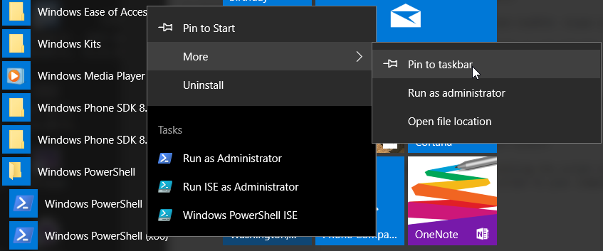

# PowerShell Setup
With newer versions of Windows, PowerShell is installed by default but not likely enabled.

On Windows 10 PowerShell is installed by default, but the execution policy needs to be set to unrestricted which requires lanuching PowerShell in administrative mode.

After finding PowerShell in the Windows PowerShell folder in the start menu, select the option 'Pin to taskbar'.

From the TaskBar, right-click on the PowerShell icon and select **Run As Administrator**.

In the PowerShell console window, enter the following command.

    PS> set-executionpolicy -unrestricted

**Enter the command 'exit' to quit the console window**

There is not any reason to run PowerShell in administrative to complete the remaining setup.

Start the PowerShell again and verify the installed version of PowerShell.

    PS> $PSVerstionTable

You'll need to running version 5 or newer.

***
# Install the Venom module

There are basically two ways to install the **Venom** module.  For those not that familiar with PowerShell or Windows, the easiest is to use the **Install-Script** command.

    PS> Install-Module Venom -Scope currentuser

If the PowerShellGet module is not already installed, there will be a prompt requesting permission to install the module. A selection of 'Yes' is the right answer.

If the **Venom** module has already been installed, it can be updated to the latest version by entering the command:

    PS> Update-Module Venom

The other method of installing the script is to use the normal GitHub process of cloning the script to your computer.

# Other Modules/Software to Install

## Dell/EMC Symmetrix Storage Arrays

For Dell/EMC symmetric storage arrays support, the **Solution Enabler** product will need to be installed. This product contains the CLI commands used to communication with the storage arrays. Both local and remote symcli commands will work. Using the RESTAPI is the future direction that will be used to communication with Dell/EMC storage arrays.

## PureStorage Arrays

    PS> Install-Module PureStoragePowerShellSDK -Scope currentuser

## Other SAN devices

Communication with other storage arrays and devices use either the RESTAPI or the SSH protocol for communications.

    PS> Install-Module Posh-SSH -Scope currentuser

