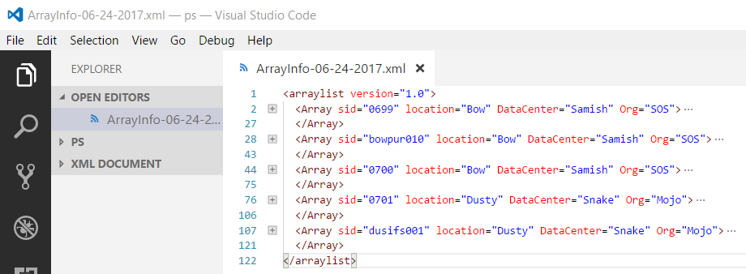

# Venom Setup

The cmdlets in the **Venom** module depend on a specific folder structure, so create a folder were the cmdlets will always be executed.

    PS> New-Item -Patch C:\Venom -ItemType Directory

A folder named, **ArrayInfo** will be created automatically and will contain a XML files named, **ArrayInfo-MM-dd-yyyy.xml**. These are the XML database files containing storage array records.  At least two XMLDB files should always be present in this folder.

Execute the following to create the folder and example XML databases.

    PS> Get-VeArrayInfo

The most recent XMLDB file, ArrayInfo-MM-dd-yyyy.xml is always loaded by default. The initial XMLDB will have bogus array records in them which require updating to contain valid array information.

The array entries are added and updated using any ASCII editor. **See the XMLDB setup documentation for information about configurng the XMLDB**.

The cmdlet, **Get-VeArrayInfo** will work fine using the example XMLDB, but other cmdlets will attempt to communicate to the arrays.
