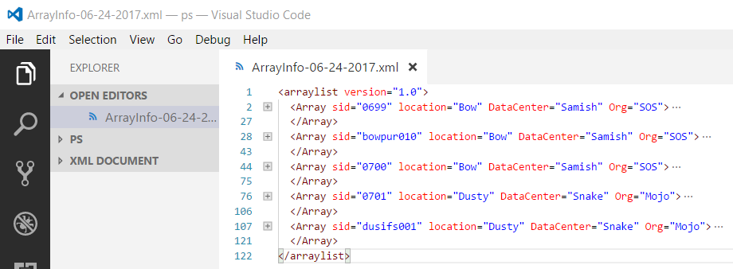

# XMLDB Setup

The folder named, **ArrayInfo** contains a set of XML files named, **ArrayInfo-MM-dd-yyyy.xml**. Each time the cmdlet, **Update-VeArrayInfo** is executed a new XMLDB file be generated.  The cmdlet, **Get-VeArrayInfo** always the most recent XMLDB file based on the lastwrite file attribute.

The XMLDB file has a simple record structure that is easily maintained with any ASCII editor.

There is one array tag for each storage array to be defined. Each array tag has a set of attribute defined that are used as indexes into the data.

Attribute | Description
--------- | -----------
sid | a unique four digit serial number of the within the **Org** attribute
Org | unique tenant name who owns the storage arrays
location | Name of the city where the array is located
DataCenter | Name of the building where the array is housed

Within each array tag, there are a set of tags that further define information about the array.

Array tag | Description
--------- | -----------
Name | A unique name of the array. Typically the name should be resolvable by DNS
Class | A class category of the array
Model | Model type of the array
Monitor | for future implementation
remote | Identifies how to reach the array via CLI.  For Symmetrix arrays, this will be the name specified in the netcfng file. For other arrays types, this will be a DNS resolvable name or and IP address.
restapi | IP address or DNS resolvable name point to the RESTAPI server
username | Account used to log into the RESTAPI
usage | The mission of the storage array.
Rack | The Rack, Row, and PanelRU identify the array location within the DataCenter.
     | The remaining array tags are capacity tags that are automatically updated by the **Update-VeArrayInfo** cmdlet.

